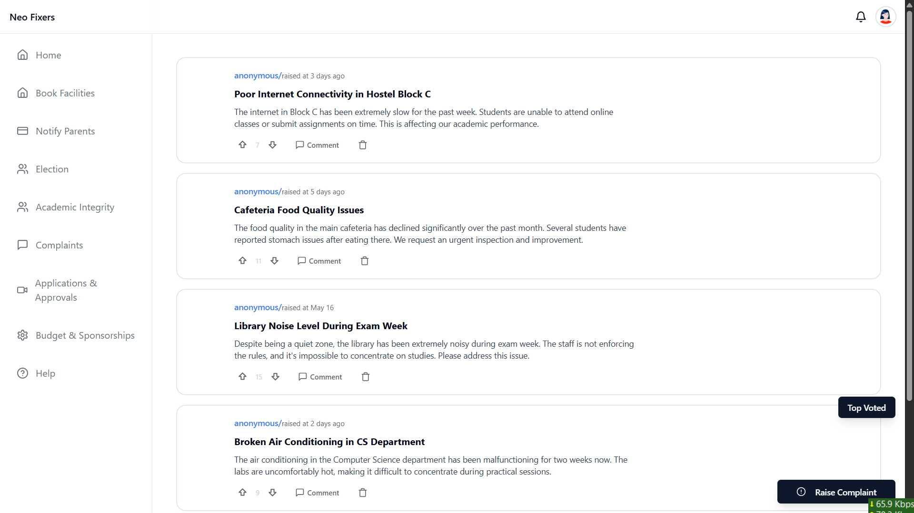
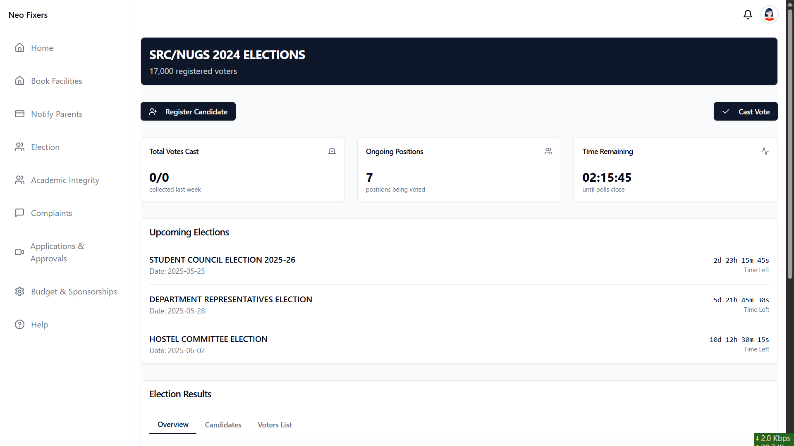
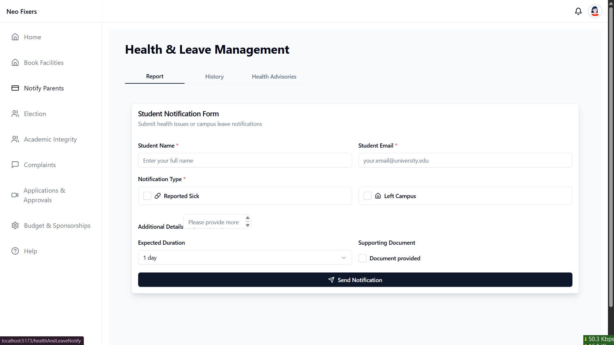
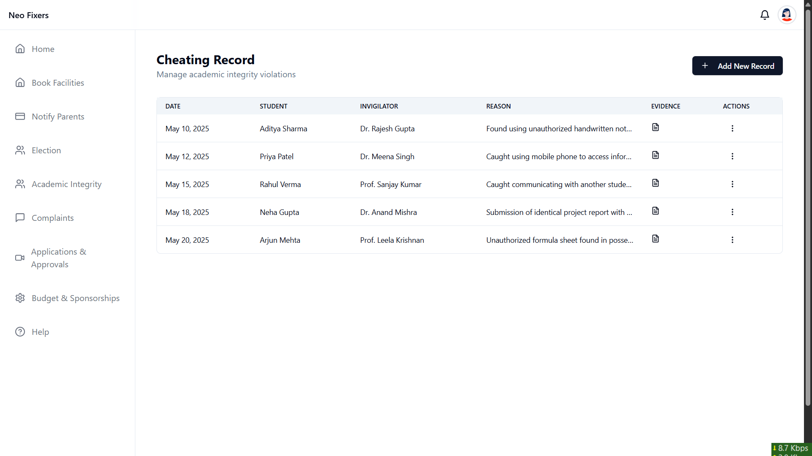
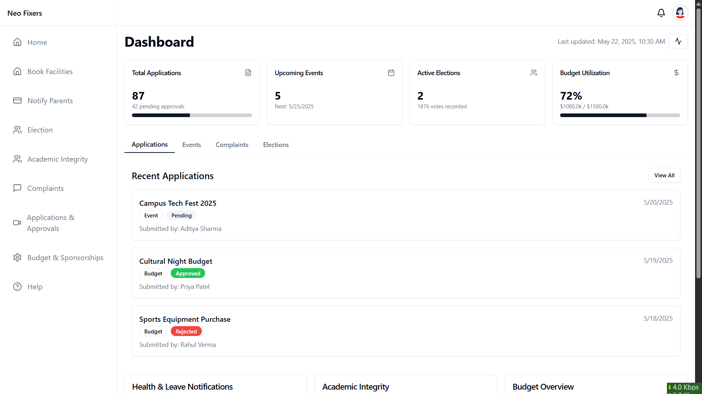

# HackFusion 2025

**Background:**
Colleges often struggle with transparency in administrative processes, student elections, financial tracking, and complaint management. Manual processes lead to delays, lack of accountability, and limited student involvement. An automated, paperless system can improve efficiency, fairness, and accessibility.

**Problem:**
Current college administrative processes lack transparency, efficiency, and accessibility for students and faculty. There is no centralized digital system to manage elections, approvals, complaints, budget tracking, and student-related notifications.

**Proposed Solution:**
Develop a web or mobile-based platform that digitizes key administrative functions in a transparent and structured manner. The system will ensure fair elections, automated approvals, budget accountability, and anonymous complaint handling, while making key information accessible to students and faculty.

## Key Features

### 1. Application and Approval System
- Streamlined digital process for club event applications, leave requests, and facility reservations
- Automated approval workflows with clear status tracking
- Notification system for application updates


### 2. Anonymous Complaint System
- Students can submit anonymous complaints visible to all
- Moderation system to filter inappropriate content
- Voting mechanism for highlighting important issues
- Option for identity revelation with proper authorization



### 3. Budget and Sponsorship Tracking
- Transparent tracking of club budgets and sponsorship funds
- Detailed expenditure records with approval workflow
- Financial analytics and reporting tools


### 4. Student Elections Portal
- Digital platform for nominations, campaigns, and voting
- Live election results with transparency measures
- Historical election data archive



### 5. Health & Leave Notification System
- Streamlined process for reporting health issues and requesting leave
- Automated notifications to relevant faculty
- Record-keeping of health incidents and absences



### 6. Academic Integrity System
- Centralized database of academic integrity violations
- Fair and transparent reporting system
- Confidential access controls



### 7. Unified Dashboard
- Centralized interface for accessing all features
- Personalized notifications and updates
- Role-based access controls



## Technologies Used

### Frontend
- React.js with Vite
- Tailwind CSS
- Shadcn UI Components
- Context API for state management

### Backend
- Node.js with Express
- MongoDB for database
- JWT for authentication
- Multer for file uploads
- Cloudinary for media storage

## Run Locally

Clone the project

```bash
  git clone https://github.com/AdarshCodeRealm/HackFusion-2025.git
```

Go to the project directory

```bash
  cd HackFusion-2025
```

### Setting up the Backend

```bash
  cd backend
  npm install
  npm run dev
```

### Setting up the Frontend

```bash
  cd frontend
  npm install
  npm run dev
```

## Environment Variables

To run this project, you will need to add the following environment variables to your .env file in the backend directory:

```
PORT=5000
MONGODB_URI=your_mongodb_connection_string
JWT_SECRET=your_jwt_secret
CLOUDINARY_CLOUD_NAME=your_cloudinary_name
CLOUDINARY_API_KEY=your_cloudinary_key
CLOUDINARY_API_SECRET=your_cloudinary_secret
```

## API Reference

The API documentation is available at `/api-docs` when running the backend server.

## Authors

- [@AdarshCodeRealm](https://github.com/AdarshCodeRealm/)
- [@Shruti-ops](https://github.com/Shruti-ops/)
- [@VivekShahare04](https://github.com/VivekShahare04)
- [@AsthaDhapodkar](https://github.com/AsthaDhapodkar)

## License

[MIT](https://choosealicense.com/licenses/mit/)

